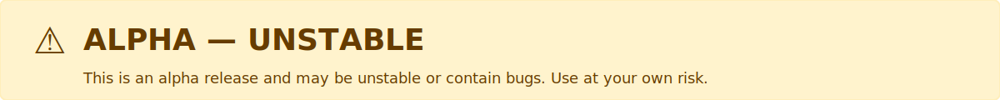

# Orion's Gate



> ⚠️ **Warning — Alpha release**  
> This is a preview release and may be unstable or contain bugs. Use with caution.


> **Modern YouTube client for Linux/Windows: DPI bypass, ad blocking, privacy, automatic voice-over translation (VOT).**

---


## ✨ Features

- **VOT (Voice Over Translation)** — automatic translation of YouTube voice-overs (VOT userscript integrated)
- **DPI bypass** (Demergi included, optional)
- **Ad blocking** (Ghostery engine, cosmetic filters)
- **Modern UI** (React + Tailwind)
- **Localization**: Russian, English, German, French
- **Themes**: YouTube Dark/Light, Auto
- **Hotkeys**: Alt+←/→, Ctrl+K, Ctrl+,
- **Portable**: AppImage, RPM, DEB, NSIS (exe, msi)

---

## 🚀 Quick Start

```bash
# 1. Install dependencies
npm install

# 2. Run in development mode
npm run dev

# 3. Build for production
npm run build

# 4. Start the packaged app
npm start
```

## Logs

- Console or file: when the app is started from a terminal (TTY), logs are written to the console. If the packaged app starts without a console, logs are saved to a single file.
- Single log file: on start a `main.log` file is created (and overwritten) in `app.getPath('userData')/logs/`.
  - Linux (example): `~/.config/orions-gate/logs/main.log`
  - Windows (example): `%APPDATA%\\orions-gate\\logs\\main.log` (typically `C:\\Users\\<User>\\AppData\\Roaming\\orions-gate\\logs\\main.log`)
  - macOS (example): `~/Library/Application Support/orions-gate/logs/main.log`
- Critical events persisted: important events (window close, application quit, SIGINT/SIGTERM, uncaught exceptions/unhandled rejections) are synchronously appended to the log on shutdown to reduce the chance of data loss.
- View logs: use the provided npm scripts or platform commands below.

Linux (tail):

```bash
npm run logs
```

Cross-home (auto path):

```bash
npm run logs:auto
```

Windows (PowerShell):

```powershell
Get-Content "$env:APPDATA\\orions-gate\\logs\\main.log" -Tail 200 -Wait
# or open in Notepad:
notepad "$env:APPDATA\\orions-gate\\logs\\main.log"
```

macOS (tail):

```bash
tail -n 200 -f "~/Library/Application Support/orions-gate/logs/main.log"
```

If you prefer different behavior (always write to file when running from a terminal, or rotate logs instead of overwriting), I can add an environment variable or change the rotation policy.

## 🛠️ Building installers

- **Windows (NSIS):**
    ```bash
    npm run make:win
    ```
- **Linux (DEB):**
    ```bash
    npm run make:deb
    ```
- **Linux (RPM):**
    ```bash
    npm run make:rpm
    ```
- **Linux (AppImage):**
    ```bash
    npm run make:appimage
    ```
- **ALT Linux (native RPM):**
    ```bash
    bash scripts/build-altlinux.sh
    ```

All installers and artifacts appear in the `release/` folder. The binary is always named `orions-gate`, desktop integration uses `orions-gate.desktop`, icons are installed as `orions-gate` in the hicolor theme.

## 🌐 Localization

- Interface: Russian, English, German, French
- Add a translation: `src/renderer/locales/<lang>/translation.json`

## 🧩 Technologies

- **Electron 40+**
- **React 18 + TypeScript 5**
- **Vite, TailwindCSS, Zustand, i18next**
- **Ghostery Adblocker**
- **Demergi DPI bypass**

## 🤝 Contributing & Support

Pull requests and bug reports are welcome! See [CONTRIBUTING.md](CONTRIBUTING.md).

## 📄 License

MIT. See [LICENSE](LICENSE).

---

## Project structure
```
src/
    main/         # Electron main process
    preload/      # Preload scripts (window.orion, VOT)
    renderer/     # React UI, components, localization
        components/ # FAB, Settings, Search, Overlay
        state/      # Zustand stores
        locales/    # i18n (en, ru, de, fr)
        App.tsx     # Root component
    shared/       # Shared types and utilities
        api.ts      # OrionBridge types
        settings.ts # Settings schema (Zod)
assets/         # VOT assets
resources/      # Icons/resources for packaging
public/         # demergi.js
scripts/        # build and icon scripts
tests/          # Playwright E2E
dist/           # Build output
release/        # Installers
```

## Configuration files
- electron-builder.yml — packaging (includes VOT assets)
- tsup.config.ts — build for main/preload (copies assets)
- vite.renderer.config.ts — renderer build
- playwright.config.ts — E2E
- package.json — scripts and dependencies

## VOT integration
Orion's Gate includes Voice Over Translation by [ilyhalight](https://github.com/ilyhalight/voice-over-translation).

**How it works**
1. Auto-inject VOT on YouTube pages
2. GM-API shim in the webview preload
3. Settings stored at: `userData/vot-data/vot-storage.json`
4. Network requests via Electron `net.request` (no CORS)
5. Webview sandboxing for security

**IPC handlers (votBridge.ts)**
- `vot:get-file`
- `vot:storage:dump/set/del/list`
- `vot:http`
- `vot:notify`
- `vot:download`

**If the VOT button didn't appear**
- Open the YouTube webview DevTools (Settings → DevTools → YouTube DevTools)
- Check `[VOT]` logs in the console
- Expected sequence: Loaded → Preparing injection → Injecting → Loaded

## Settings
- User-Agent: Chrome Desktop/Android or custom
- DPI bypass (Demergi): mode, port, exceptions list, autostart
- Ad blocker: filter levels, statistics
- UI: language, theme, scale, transparency, animations
- Window: size, always-on-top, minimum size
- FAB: position, offset, size, shape, transparency, button order
- DevTools: window and YouTube webview

## Hotkeys
- Alt + ← / Alt + → — Navigation
- Ctrl + K — Search
- Ctrl + , — Settings
- Ctrl + Shift + D — Diagnostics
- Esc — Close overlays (if enabled)

## Security
- Webview sandboxing (`contextIsolation: true`, `sandbox: true`)
- Node integration disabled in renderer/webview
- Strict CSP and blocked external navigation
- IPC limited to preload bridges

## Architecture
**Main process** — windows, settings, DPI, VOT IPC, DevTools

**Preload** — `preload/index.ts` (window.orion), `preload/webview.ts` (VOT + GM-API)

**Renderer** — React 18, Zustand, i18next, Tailwind, custom Icon component

**Webview**
```
BrowserWindow
 └─ React Renderer
     └─ WebviewHost
         └─ <webview> (sandbox)
             ├─ YouTube
             └─ Webview Preload (VOT)
                 ├─ GM-API shim
                 ├─ VOT Bridge (IPC)
                 └─ VOT Userscript
```

## CI/CD
- .github/workflows/build.yml — builds: Linux (deb, AppImage), Windows (NSIS/MSI), Alt Linux (RPM)
- .github/workflows/release.yml — releases on tags v*, upload artifacts

## Logs

- Console or file: when the app runs from a terminal (TTY), logs are written to the console. If the packaged app runs without a console, logs are saved to a single file.
- Single log file: on start, a `main.log` file is created (and overwritten) in `app.getPath('userData')/logs/`. On Linux this is usually `~/.config/orions-gate/logs/main.log`.
- Critical events persisted: important events (window close, app quit, SIGINT/SIGTERM, uncaught exceptions/unhandled rejections) are synchronously appended on shutdown to reduce the risk of data loss.
- View logs: use the npm scripts:

```bash
npm run logs      # simple tail (Linux path)
npm run logs:auto # compute path and follow the log
```

If you need different behaviour (always write file when started from a terminal, or rotate logs instead of overwriting), I can add an environment variable or change the rotation policy.

## Known issues
- MaxListenersExceededWarning (adblock statistics)
- Possible Demergi timeouts for some Google services
- SSL handshake warnings due to DPI bypass

## Getting involved
- `npm run dev` to develop
- `npm run typecheck` for TS checks
- Before pushing, verify packaging: `npm run make:win` (or your platform)

## License
MIT License — see LICENSE.

## Thanks
- [VOT (Voice Over Translation)](https://github.com/ilyhalight/voice-over-translation) — author ilyhalight
- [Demergi](https://github.com/ValdikSS/demergi) — DPI bypass
- [Ghostery Adblocker](https://www.ghostery.com/) — Ghostery
- [Electron](https://www.electronjs.org/), [React](https://react.dev/), [Vite](https://vitejs.dev/), [TypeScript](https://www.typescriptlang.org/)

## Support
Questions and suggestions — use GitHub issues.

---
Version: 2.0.0-alpha.0 · Electron: 40.0.0 · Node: >=18 · Platforms: Windows, Linux

