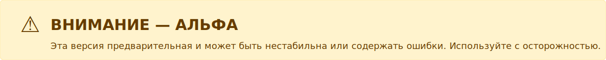
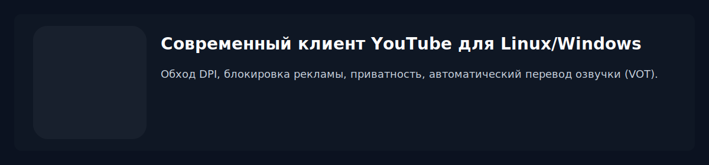

# Orion's Gate



> ⚠️ **Внимание — альфа‑релиз**  
> Эта версия является предварительной и может быть нестабильна или содержать ошибки. Используйте с осторожностью.



> **Современный клиент YouTube для Linux/Windows: обход DPI, блокировка рекламы, приватность, автоматический перевод озвучки (VOT).**

---


## ✨ Возможности

- **VOT (Voice Over Translation)** — автоматический перевод озвучки YouTube (интеграция userscript VOT)
- **Обход DPI** (Demergi встроен, опционально)
- **Блокировка рекламы** (Ghostery, косметические фильтры)
- **Современный UI** (React + Tailwind)
- **Мультиязычность**: русский, английский, немецкий, французский
- **Темы**: YouTube тёмная/светлая, авто
- **Горячие клавиши**: Alt+←/→, Ctrl+K, Ctrl+,
- **Портативность**: AppImage, RPM, DEB, NSIS(exe,msi)

---

## 🚀 Быстрый старт

```bash
# 1. Установите зависимости
npm install

# 2. Запуск в режиме разработки
npm run dev

# 3. Сборка релиза
npm run build

# 4. Запуск собранного приложения
npm start
```
## Логи

- Консоль или файл: если приложение запущено из терминала (TTY), логи выводятся в консоль. Если упакованное приложение запускается без консоли, логи сохраняются в одиночный файл.
 - Один файл логов: при старте создаётся (и перезаписывается) файл `main.log` в папке `app.getPath('userData')/logs/`.
    - Linux (пример): `~/.config/orions-gate/logs/main.log`
    - Windows (пример): `%APPDATA%\\orions-gate\\logs\\main.log` (обычно `C:\\Users\\<Пользователь>\\AppData\\Roaming\\orions-gate\\logs\\main.log`)
    - macOS (пример): `~/Library/Application Support/orions-gate/logs/main.log`
- Сохранение критичных событий: важные события (закрытие окна, завершение приложения, SIGINT/SIGTERM, uncaught exceptions/unhandled rejections) синхронно дописываются в лог при завершении, чтобы снизить риск потери данных.
- Просмотр логов: используйте npm-скрипты:

```bash
npm run logs      # простая команда tail (Linux-путь)
npm run logs:auto # вычислить путь и следить за логом
```

Дополнительные команды по платформам:

- Windows (PowerShell):

```powershell
Get-Content "$env:APPDATA\\orions-gate\\logs\\main.log" -Tail 200 -Wait
# или открыть в Блокноте:
notepad "$env:APPDATA\\orions-gate\\logs\\main.log"
```

- macOS (tail):

```bash
tail -n 200 -f "~/Library/Application Support/orions-gate/logs/main.log"
```

Если нужно другое поведение (всегда писать файл при запуске из консоли или ротация логов вместо перезаписи), могу добавить переменную окружения или изменить политику ротации.


## 🛠️ Сборка установщиков

- **Windows (NSIS):**
    ```bash
    npm run make:win
    ```
- **Linux (DEB):**
    ```bash
    npm run make:deb
    ```
- **Linux (RPM):**
    ```bash
    npm run make:rpm
    ```
- **Linux (AppImage):**
    ```bash
    npm run make:appimage
    ```
- **ALT Linux (нативный RPM):**
    ```bash
    bash scripts/build-altlinux.sh
    ```

Все установщики и артефакты появляются в папке `release/`. Бинарник всегда называется `orions-gate`, desktop-интеграция использует `orions-gate.desktop`, иконки устанавливаются как `orions-gate` в теме hicolor.

---

## 🌐 Локализация

- Интерфейс: русский, английский, немецкий, французский
- Добавить перевод: `src/renderer/locales/<lang>/translation.json`

---

## 🧩 Технологии

- **Electron 40+**
- **React 18 + TypeScript 5**
- **Vite, TailwindCSS, Zustand, i18next**
- **Ghostery Adblocker**
- **Demergi DPI bypass**

---

## 🤝 Вклад и поддержка

Пулл-реквесты и багрепорты приветствуются! Подробнее — в [CONTRIBUTING.md](CONTRIBUTING.md).

---

## 📄 Лицензия

MIT. См. [LICENSE](LICENSE).

---


## Структура проекта
```
src/
    main/         # Главный процесс Electron
    preload/      # Preload-скрипты (window.orion, VOT)
    renderer/     # React-интерфейс, компоненты, локализация
        components/ # FAB, Settings, Search, Overlay
        state/      # Zustand сторы
        locales/    # i18n (en, ru, de, fr)
        App.tsx     # Корневой компонент
    shared/       # Общие типы и утилиты
        api.ts      # Типы OrionBridge
        settings.ts # Схема настроек (Zod)
assets/         # VOT ассеты
resources/      # Иконки/ресурсы для упаковки
public/         # demergi.js
scripts/        # Скрипты сборки и иконок
tests/          # Playwright E2E
dist/           # Результат сборки
release/        # Инсталляторы
```

## Конфигурационные файлы
- electron-builder.yml — упаковка (включает VOT ассеты)
- tsup.config.ts — сборка main/preload (копирует ассеты)
- vite.renderer.config.ts — сборка renderer
- playwright.config.ts — E2E
- package.json — скрипты и зависимости

## Интеграция VOT
Orion's Gate включает Voice Over Translation от [ilyhalight](https://github.com/ilyhalight/voice-over-translation).

**Как это работает**
1. Авто-инжект VOT на страницах YouTube
2. GM-API shim в webview preload
3. Хранение настроек: userData/vot-data/vot-storage.json
4. Сетевые запросы через Electron net.request (без CORS)
5. Песочница webview для безопасности

**IPC обработчики (votBridge.ts)**
- `vot:get-file`
- `vot:storage:dump/set/del/list`
- `vot:http`
- `vot:notify`
- `vot:download`

**Если кнопка VOT не появилась**
- Откройте DevTools YouTube webview (Настройки → DevTools → DevTools YouTube)
- Проверьте логи `[VOT]` в консоли
- Ожидаемая последовательность: Loaded → Preparing injection → Injecting → Loaded

## Настройки
- User-Agent: Chrome Desktop/Android или кастомный
- DPI обход (Demergi): режим, порт, список исключений, автозапуск
- Блокировщик рекламы: уровни фильтрации, статистика
- Интерфейс: язык, тема, масштаб, прозрачность, анимации
- Окно: размеры, поверх всех окон, мин. размеры
- FAB: позиция, отступ, размер, форма, прозрачность, порядок кнопок
- DevTools: окно и YouTube webview

## Горячие клавиши
- Alt + ← / Alt + → — Навигация
- Ctrl + K — Поиск
- Ctrl + , — Настройки
- Ctrl + Shift + D — Диагностика
- Esc — Закрыть оверлеи (если включено)

## Безопасность
- Песочница webview (`contextIsolation: true`, `sandbox: true`)
- Node integration отключен в renderer/webview
- Строгая CSP и блок внешней навигации
- IPC ограничен preload мостами

## Архитектура
**Главный процесс** — окна, настройки, DPI, VOT IPC, DevTools

**Preload** — `preload/index.ts` (window.orion), `preload/webview.ts` (VOT + GM-API)

**Renderer** — React 18, Zustand, i18next, Tailwind, кастомный Icon компонент

**Webview**
```
BrowserWindow
 └─ React Renderer
     └─ WebviewHost
         └─ <webview> (sandbox)
             ├─ YouTube
             └─ Webview Preload (VOT)
                 ├─ GM-API shim
                 ├─ VOT Bridge (IPC)
                 └─ VOT Userscript
```

## CI/CD
- .github/workflows/build.yml — сборки: Linux (deb, AppImage), Windows (NSIS/MSI), Alt Linux (RPM)
- .github/workflows/release.yml — релизы по тегам v*, загрузка артефактов

## Логи

- Консоль или файл: если приложение запущено из терминала (TTY), логи выводятся в консоль. Если упакованное приложение запускается без консоли, логи сохраняются в одиночный файл.
- Один файл логов: при старте создаётся (и перезаписывается) файл `main.log` в папке `app.getPath('userData')/logs/`. На Linux обычно это `~/.config/orions-gate/logs/main.log`.
- Сохранение критичных событий: важные события (закрытие окна, завершение приложения, SIGINT/SIGTERM, uncaught exceptions/unhandled rejections) синхронно дописываются в лог при завершении, чтобы снизить риск потери данных.
- Просмотр логов: используйте npm-скрипты:

```bash
npm run logs      # простая команда tail (Linux-путь)
npm run logs:auto # вычислить путь и следить за логом
```

Если нужно другое поведение (всегда писать файл при запуске из консоли или ротация логов вместо перезаписи), могу добавить переменную окружения или изменить политику ротации.

## Известные проблемы
- MaxListenersExceededWarning (статистика блокировщика)
- Возможные таймауты Demergi для некоторых Google сервисов
- SSL handshake warnings из-за обхода DPI

## Участие
- `npm run dev` для разработки
- `npm run typecheck` для TS ошибок
- Перед пушем проверяйте упаковку: `npm run make:win` (или ваша платформа)

## Лицензия
MIT License — см. LICENSE.

## Благодарности
- [VOT (Voice Over Translation)](https://github.com/ilyhalight/voice-over-translation) — автор ilyhalight
- [Demergi](https://github.com/ValdikSS/demergi) — обход DPI
- [Ghostery Adblocker](https://www.ghostery.com/) — автор Ghostery
- [Electron](https://www.electronjs.org/), [React](https://react.dev/), [Vite](https://vitejs.dev/), [TypeScript](https://www.typescriptlang.org/)

## Поддержка
Вопросы и предложения — через issues на GitHub.

---
Версия: 2.0.0-alpha.0 · Electron: 40.0.0 · Node: >=18 · Платформы: Windows, Linux
